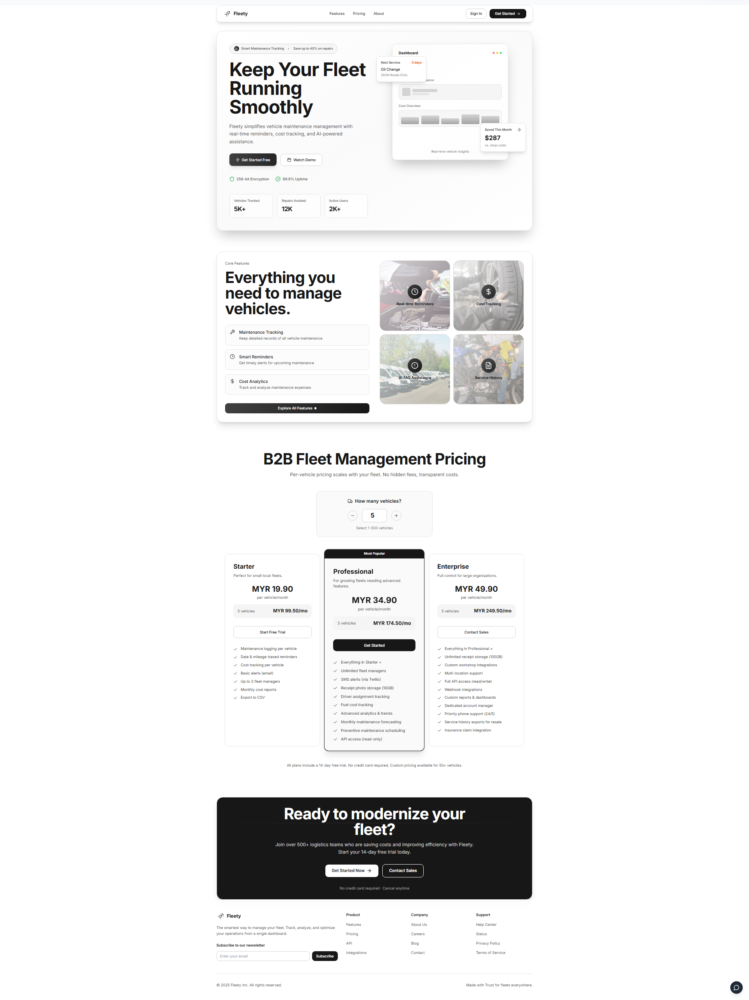
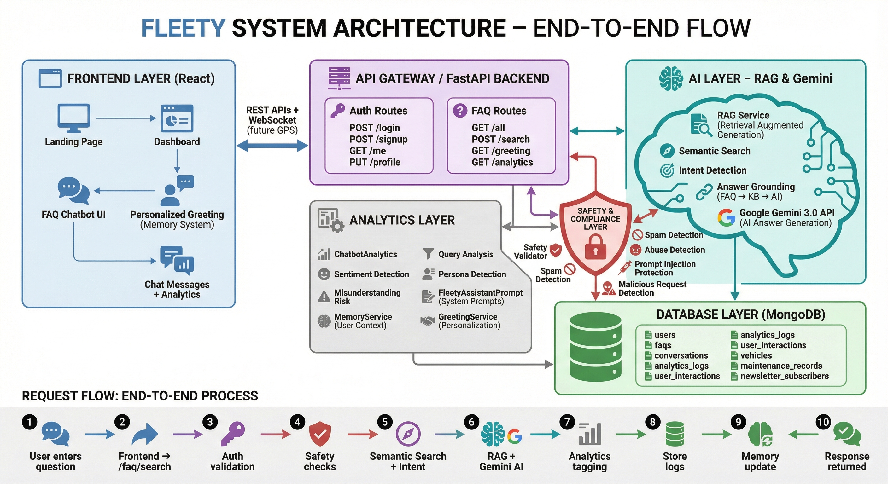

<<<<<<< HEAD
# Fleety - Vehicle Maintenance Management System
=======



# Fleety - Vehicle Maintenance Management System


>>>>>>> 8095afc (Update new Readme.md)

A full-stack web application to track vehicle maintenance, reminders, and AI-powered FAQs.

**Demo**: Frontend `http://localhost:5173` | Backend API `http://localhost:8000/docs`

---

## Features

* **Authentication**: Signup/login, password reset
* **Vehicle Management**: Add/edit/delete vehicles
* **Maintenance Tracking**: Log costs and notes
* **Reminders**: Notifications for upcoming maintenance
* **AI FAQ Assistant**: Chat-based help
* **Support & Email**: Contact support, email integration

**Security**: JWT, bcrypt, token expiry, CORS, input validation

---

## Tech Stack

* **Frontend**: React, TypeScript, TailwindCSS, Vite
* **Backend**: FastAPI, Python, PyMongo
* **Database**: MongoDB Atlas
* **AI/ML**: Ollama, nomic-embed-text, Llama2 (optional)
* **Email**: SMTP

---



## Quick Start

### Backend

```bash
cd backend
python -m venv venv
source venv/bin/activate  # macOS/Linux
.\venv\Scripts\Activate.ps1   # Windows
pip install -r requirements.txt
copy .env.example .env
python -m uvicorn app.main:app --reload
```

Runs at `http://localhost:8000`

### Frontend

```bash
cd frontend
npm install
copy .env.example .env
npm run dev
```

Runs at `http://localhost:5173`

---

## Project Structure

```
fleety/
├── backend/        # FastAPI app, models, routes, utils
├── frontend/       # React app, components, pages, types
├── README.md       # This file
└── other scripts   # DB and testing scripts
```

---

## Key Endpoints

* **Auth**: `/signup`, `/login`, `/me`, `/forgot-password`, `/reset-password`
* **Vehicles**: `/vehicles` CRUD
* **Maintenance**: `/maintenance/vehicle/{id}` CRUD
* **Reminders**: `/reminders/vehicle/{id}` CRUD
* **FAQ & Support**: `/faq/all`, `/faq/search`, `/support/inquire`

---

## Testing

* Backend tests: `python test_api.py`, `python test_password.py`
* Manual tests: curl/Postman at `http://localhost:8000/docs`

---

## License

MIT License
